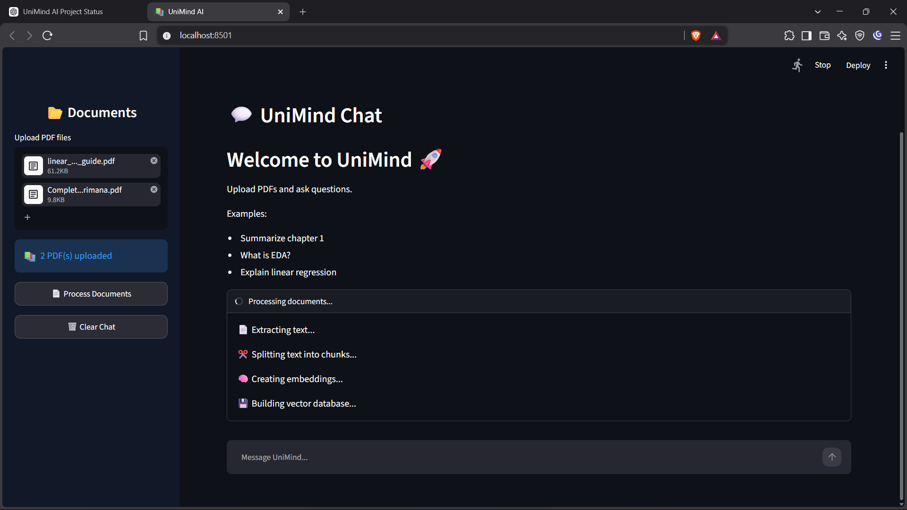

# 🤖 UniMind AI - AI Powered PDF Chat Assistant


UniMind AI is a **Retrieval Augmented Generation (RAG) based PDF chatbot** that allows users to upload PDF documents and interact with them using natural language.

The application extracts information from uploaded PDFs, converts the content into meaningful embeddings, stores them in a FAISS vector database, retrieves relevant context, and generates AI-powered answers using an LLM.

---

# 🚀 Features

- 📄 Upload multiple PDF documents
- 🔍 Extract text from PDF files
- ✂️ Intelligent text chunking
- 🧠 Generate semantic embeddings
- 💾 Store embeddings using FAISS vector database
- 🔎 Similarity-based document retrieval
- 🤖 RAG-based question answering
- 💬 ChatGPT-style chat interface
- ⚡ Streaming AI responses
- 📚 Source references with:
  - File name
  - Page number
  - Chunk ID

---

# 🏗️ How UniMind AI Works

```
              User
               |
               |
        Upload PDF Documents
               |
               |
        PDF Text Extraction
               |
               |
        Text Chunking
               |
               |
        Embedding Generation
               |
               |
        FAISS Vector Database
               |
               |
        Similarity Search
               |
               |
        Groq LLM (Llama)
               |
               |
        AI Generated Answer
```

---

# 🛠️ Tech Stack

## Programming Language
- Python

## Frontend
- Streamlit

## AI / LLM
- Groq API
- Llama 3.3 70B

## Frameworks
- LangChain

## Embeddings
- HuggingFace Sentence Transformers

## Vector Database
- FAISS

## PDF Processing
- PyPDF

---

# 📂 Project Structure

```
UniMind-AI/
│
├── app.py                         # Main Streamlit application
├── requirements.txt               # Project dependencies
├── README.md
├── .gitignore
│
├── assets/
│   └── screenshots/
│       ├── home.png
│       ├── upload.png
│       ├── processing.png
│       └── chat.png
│
├── src/
│   └── core/
│       │
│       ├── pdf_loader.py          # PDF text extraction
│       ├── text_splitter.py       # Document chunking
│       ├── embeddings.py          # Embedding generation
│       ├── vector_store.py        # FAISS vector database
│       └── rag_pipeline.py        # Retrieval + LLM pipeline
│
└── tests/
    ├── test_vector_store.py
    └── test_rag_pipeline.py
```

---

# ⚙️ Installation & Setup

## 1. Clone the repository

```bash
git clone https://github.com/yourusername/UniMind-AI.git
```

Navigate into the project:

```bash
cd UniMind-AI
```

---

## 2. Create Virtual Environment

```bash
python -m venv venv
```

Activate the environment:

### Windows

```bash
venv\Scripts\activate
```

---

## 3. Install Dependencies

```bash
pip install -r requirements.txt
```

---

## 4. Configure API Key

Create a `.env` file in the project root.

Add your Groq API key:

```env
GROQ_API_KEY=your_api_key_here
```

---

# ▶️ Running the Application

Start the Streamlit application:

```bash
streamlit run app.py
```

The application will open in your browser.

---

# 📸 Screenshots

## 🏠 Home Interface


## 📂 Upload Documents


## ⚙️ Document Processing




## 💬 Chat Interface


---

# 💡 Example Questions

After uploading PDFs, users can ask:

```
What is Exploratory Data Analysis?
```

```
Explain linear regression.
```

```
Summarize this document.
```

```
What are the important concepts from this PDF?
```

---

# 🧪 Testing

The project includes testing for:

- PDF loading
- Text splitting
- Embedding generation
- FAISS vector store creation
- Retrieval pipeline
- RAG response generation

Run tests:

```bash
pytest
```

---

# 🔮 Future Improvements

- Conversation memory
- Support for DOCX, PPT and TXT files
- User authentication
- Cloud deployment
- Better document management
- Multiple user support
- Voice-based interaction

---

# 👨‍💻 Author

**Somya Kumar**

Computer Science Engineering Student

Interested in:
- Artificial Intelligence
- Machine Learning
- Generative AI
- Retrieval Augmented Generation

---

# 🙏 Acknowledgements

Special thanks to:

- LangChain
- HuggingFace
- FAISS
- Groq
- Streamlit

for providing the tools and frameworks used in this project.