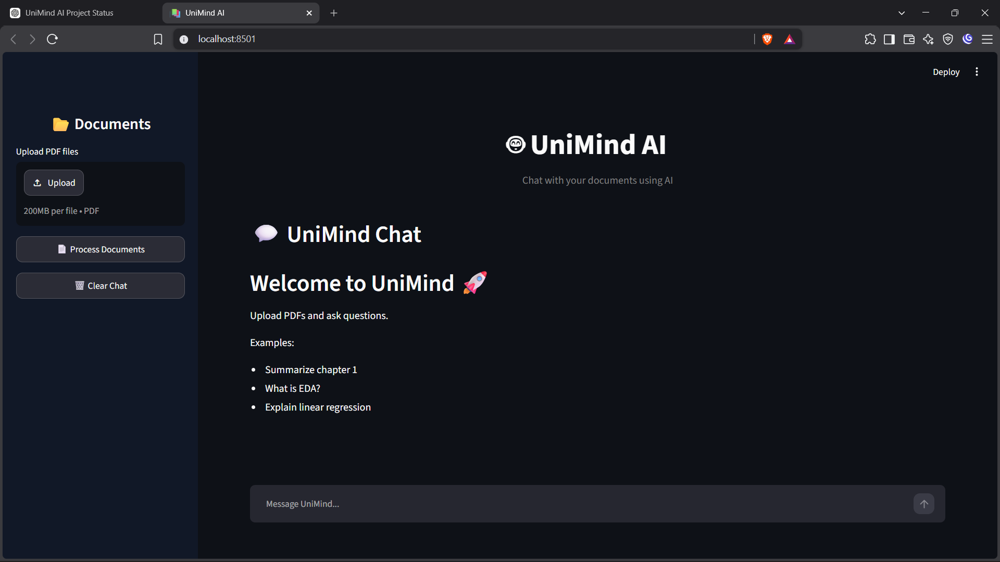
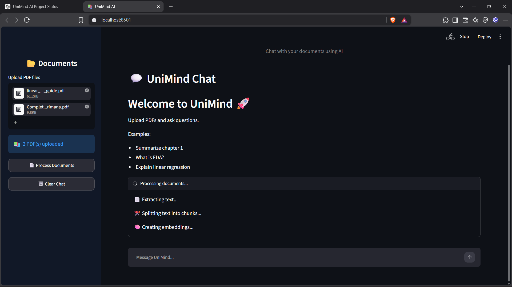
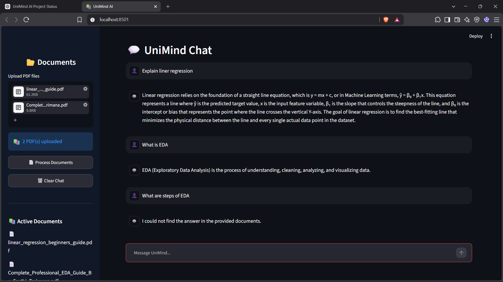

# 🤖 UniMind AI - AI Powered PDF Chat Assistant


## 🌐 Live Demo

🚀 Try UniMind AI here:

https://unimind-ai-anou2gn6gpq9nmpupqkstm.streamlit.app/

---

# 📌 About The Project

**UniMind AI** is an AI-powered PDF chatbot built using **Retrieval-Augmented Generation (RAG)**.

It allows users to upload PDF documents and interact with them through a ChatGPT-like interface.

The application processes documents, creates embeddings, stores them in a vector database, retrieves relevant information, and generates responses using an LLM.

This project demonstrates practical implementation of:

- PDF processing
- Text chunking
- Embeddings
- Semantic search
- Vector databases
- Retrieval-Augmented Generation
- LLM-based question answering


---

# ✨ Features

## 📂 PDF Upload

- Upload multiple PDF files
- Extract text automatically
- Preserve document metadata:
  - Filename
  - Page number
  - Chunk information


## 🧠 AI Document Understanding

- Converts document chunks into embeddings
- Stores embeddings using FAISS
- Retrieves relevant information based on user queries


## 💬 Chat With Your Documents

Users can ask questions like:

- Summarize a chapter
- Explain concepts
- Find information from notes
- Ask questions from uploaded PDFs


## 📚 Source References

Each answer provides:

- Source PDF name
- Page number
- Chunk ID


## ⚡ Streaming Responses

Responses are generated in real-time for a better conversational experience.


---

# 🏗️ System Architecture

```
                 User
                  |
                  |
            Upload PDFs
                  |
                  |
             PDF Loader
                  |
                  |
          Text Splitter
                  |
                  |
       Embedding Generator
                  |
                  |
            FAISS DB
                  |
                  |
            Retriever
                  |
                  |
             Groq LLM
                  |
                  |
          Generated Answer
```


---

# 🛠️ Tech Stack

## Programming Language

- Python 3.14


## Frontend

- Streamlit


## AI Framework

- LangChain


## LLM

- Groq API
- Llama 3.3 70B


## Embedding Model

```
sentence-transformers/all-MiniLM-L6-v2
```


## Vector Database

- FAISS


## PDF Processing

- PyPDF


---

# 📁 Project Structure

```
UniMind-AI/

│
├── app.py
│
├── src/
│   │
│   └── core/
│       │
│       ├── pdf_loader.py
│       ├── text_splitter.py
│       ├── embeddings.py
│       ├── vector_store.py
│       └── rag_pipeline.py
│
├── assets/
│   └── screenshots/
│
├── requirements.txt
│
├── README.md
│
└── .gitignore
```


---

# ⚙️ Installation & Setup


## Clone Repository

```bash
git clone YOUR_GITHUB_REPOSITORY_LINK

cd UniMind-AI
```


## Create Virtual Environment

```bash
python -m venv venv
```


Activate:

### Windows

```bash
venv\Scripts\activate
```


### Linux/Mac

```bash
source venv/bin/activate
```


## Install Dependencies

```bash
pip install -r requirements.txt
```


---

# 🔑 Environment Variables

Create a `.env` file:

```env
GROQ_API_KEY=your_api_key_here
```


For Streamlit Cloud:

Go to:

```
Streamlit Cloud
→ App Settings
→ Secrets
```

Add:

```toml
GROQ_API_KEY="your_api_key_here"
```


---

# ▶️ Run Locally

Run:

```bash
streamlit run app.py
```


Open:

```
http://localhost:8501
```


---

# 📸 Screenshots


## Home Page




## PDF Upload




## Chat Interface




## AI Response


---

# 🔄 How UniMind AI Works

1. User uploads PDF documents

2. PDF loader extracts text

3. Text splitter divides text into smaller chunks

4. Embedding model converts chunks into vectors

5. FAISS stores document vectors

6. User asks a question

7. Retriever finds relevant document chunks

8. LLM generates an answer using retrieved context


---

# 🚀 Deployment

UniMind AI is deployed using:

- Streamlit Cloud


Deployment steps:

1. Push project to GitHub
2. Connect repository with Streamlit Cloud
3. Add API key in Secrets
4. Deploy application


---

# 🔮 Future Improvements

- Conversation memory
- Better document management
- Multiple user support
- More file format support
- Voice interaction
- Improved UI animations
- Cloud-based vector databases


---

# 👨‍💻 Author

**Somya Kumar**

Computer Science Engineering Student

Interested in:
- Artificial Intelligence
- Machine Learning
- Generative AI


---

# 🙏 Acknowledgements

Thanks to:

- Streamlit
- LangChain
- HuggingFace
- FAISS
- Groq


---

⭐ If you like this project, consider giving it a star!